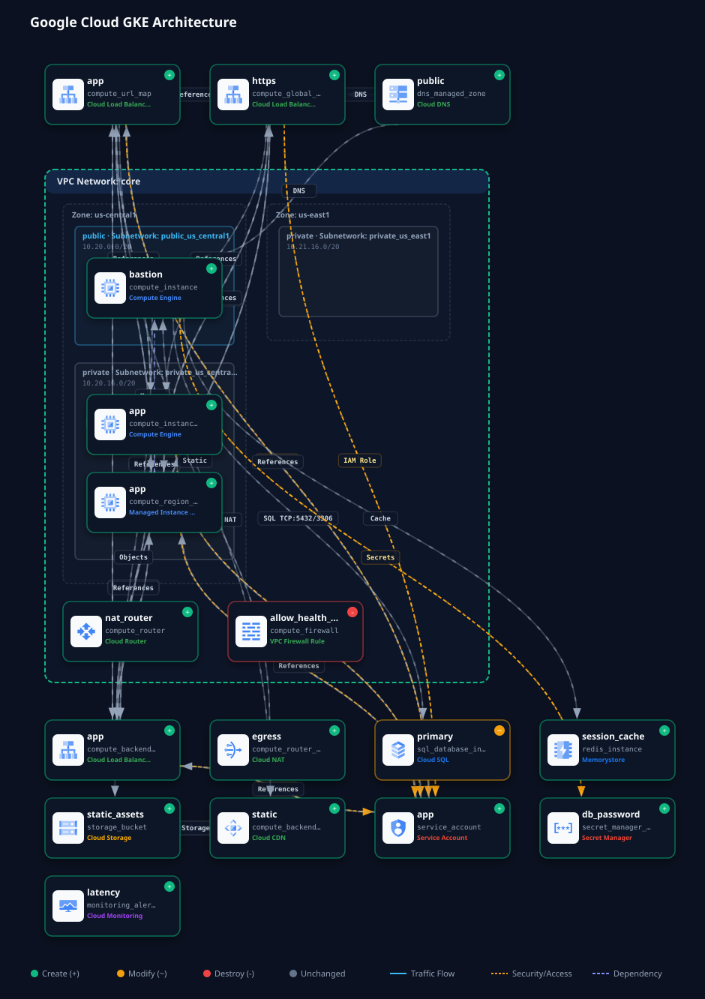

# Google Cloud GKE Terraform Infrastructure

[](https://github.com/mchittineni/gke-terraform/actions/workflows/validate.yml)
[](https://github.com/mchittineni/gke-terraform/actions/workflows/plan.yml)
[](LICENSE)
[](https://www.terraform.io/)
[](https://kubernetes.io/)
[](https://cloud.google.com/)

A production-grade, modular Infrastructure-as-Code (IaC) solution for deploying a secure, scalable **Google Kubernetes Engine (GKE)** cluster with automated CI/CD workflows, Checkov security auditing, and architecture diagram generation.

---

## Architecture Overview

The infrastructure provisions a scalable enterprise architecture in Google Cloud Platform:



- **Compute**: GKE VPC-native cluster with Workload Identity enabled, Shielded Nodes, Release Channel management, and autoscaling node pools.
- **Networking**: Custom VPC network, subnetwork with secondary IP ranges for Pods and Services, Cloud Router, and Cloud NAT for secure outbound internet egress.
- **Database**: Cloud SQL PostgreSQL 16 instance configured with Private Service Access (VPC peering), automated backups, point-in-time recovery, and Cloud SQL Auth Proxy compatibility.
- **Observability**: Cloud Logging project sink and custom bucket, error budget log metrics, and Cloud Monitoring alert policies.
- **Architecture Visualizer**: Automated plan-to-diagram visualization powered by [`tf-arch-diagram-generator`](https://github.com/mchittineni/tf-arch-diagram-generator).

---

## Repository Layout

```
gke-terraform/
├── .github/workflows/        # Production CI/CD pipelines (Validate, Plan, Apply, Destroy, Diagram)
├── docs/                     # Architecture, CI/CD pipeline, and deployment guides
├── modules/
│   └── gcp/
│       ├── compute/          # GKE cluster, node pools, service accounts, and Workload Identity
│       ├── database/         # Cloud SQL PostgreSQL, Private Service Access, and backups
│       ├── monitoring/       # Cloud Logging buckets, sinks, and Monitoring alert policies
│       └── networking/       # VPC network, subnets, Cloud Router, and Cloud NAT
├── scripts/
│   └── generate_diagram.sh   # Architecture diagram generator CLI helper
├── main.tf                   # Root configuration & module orchestration
├── variables.tf              # Input variables with validation rules
├── outputs.tf                # Cluster endpoints, IDs, and gcloud commands
├── terraform.tfvars.example  # Example variable definitions
├── .checkov.yml              # Checkov security baseline
└── .tflint.hcl               # TFLint ruleset for Google Cloud
```

---

## Quick Start

### 1. Prerequisites
- [Terraform](https://developer.hashicorp.com/terraform/downloads) `>= 1.16.1`
- [Google Cloud SDK](https://cloud.google.com/sdk/docs/install) `gcloud`
- [kubectl](https://kubernetes.io/docs/tasks/tools/) `>= 1.30`
- [Node.js](https://nodejs.org/) `>= 22` (optional, for diagram generation)

### 2. Local Initialization
```bash
# Authenticate to Google Cloud
gcloud auth application-default login

# Set active project
gcloud config set project "<PROJECT_ID>"

# Copy and configure variables
cp terraform.tfvars.example terraform.tfvars

# Initialize Terraform
terraform init

# Validate configuration
terraform validate

# Review plan
terraform plan
```

### 3. Generate Architecture Diagram
```bash
# Generate architecture SVG
./scripts/generate_diagram.sh dev

# Launch interactive browser viewer with traffic spotlighting
./scripts/generate_diagram.sh --serve
```

---

## CI/CD Automation

This repository includes production-ready GitHub Actions workflows:

1. **Validation & Security (`validate.yml`)**: Runs `terraform fmt`, `terraform validate`, `tflint`, and Checkov static analysis on pull requests and commits.
2. **Plan & Diagram (`plan.yml`)**: Authenticates via GCP Workload Identity Federation OIDC, runs `terraform plan`, renders an architecture diagram, and comments the summary on the PR.
3. **Continuous Deployment (`apply.yml`)**: Applies approved changes on merge to `main`.
4. **On-Demand Diagram (`diagram.yml`)**: Regenerates and commits updated diagrams when infrastructure code changes.
5. **Controlled Teardown (`destroy.yml`)**: Safeguarded manual destruction requiring explicit confirmation.

---

## Documentation

- [Architecture Specification](docs/architecture.md)
- [CI/CD Pipeline Guide](docs/ci-cd-pipeline.md)
- [Deployment Guide](docs/deployment-guide.md)

---

## License
MIT License. Created by [Manideep Chittineni](https://github.com/mchittineni).
